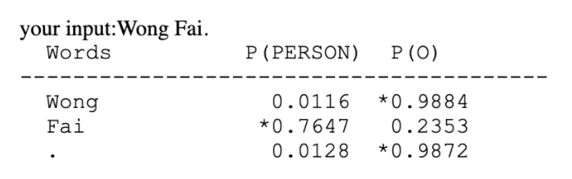
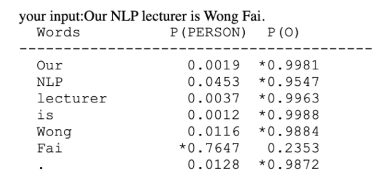
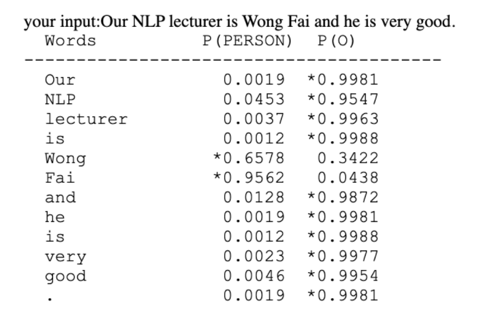

University of Macau\
Due date: 04 May, 2021

Ma Rui & Axel Mukwena


# Person Name ('Named Entity') Recognition


### Introduction
The task of this project is to implement and build a maximum entropy model (MEM) for identifying person names in newswire texts into two distinct classes, PERSON and O. Furthermore, it was required to design a web application to deploy the model and provide the main user functionality, person named entity recognition from given text.

Generally, Named-entity recognition (NER) is a subtask of information extraction that seeks to locate and classify named entities mentioned in unstructured text into predefined categories such as person names, organizations, locations, medical codes, time expressions, quantities, monetary values, percentages, etc [1].

Though numerous Machine Learning models can be used to solve the problems brought by information extraction such as entities are too numerous to include in dictionaries and unknown text variations appear constantly, the MEM offers several other advantages as a classifier for NER:

 - Performs better with sequential data, characters, words, phrases, lines, or sentences
 - Higher ability to cope effectively with limited data. [2]
 - The facts used to model the data, or features, are linguistically very simple, or "knowledge-poor" but yet succeed in approximating complex linguistic relationships. [3]

### Methods and Implementation
In this section, we discuss the methods used, implementation, and model optimization.

#### Dataset
In this project, the newswire data provided had completed text preprocessing. The dataset was divided into about 204566 Training and 51577 Testing lines of labeled words in sentence sequence. Each line is a token, followed by a tabbed space then the correct label.

```
Only      O
France    O
and       O
Britain   O
backed    O
Fischler  PERSON
's        O
proposal  O
.         O
```

Loading the data into the development space:

```
 def load_data(self, filename):
   words = []
   labels = []
   for line in open(filename, "r", encoding="utf-8"):
       doublet = line.strip().split("\t")
       if len(doublet) < 2:  # remove empty lines
           continue
       words.append(doublet[0])
       labels.append(doublet[1])
   return words, labels
```

### Model Training and Feature Extraction

Though the provided starter kit was well configured and fully set up for training, we needed to integrate more functionality during training. This includes, reshaping the original words and labels lists to sentence shapes. This change is to allow sentence analysis which tends to provide more information about each individual word, compared to a single standalone word.

```
words, labels = self.load_data(self.train_path)
sentences, labels_list = self.get_sentences(words, labels)

def get_sentences(self, words, labels):
   sentences = []
   labels_list = []
   for word in words:
 sentence = []
 sentence_label = []
	 add word to sentence
	 add label to sentence_label
       if word == ".":
           add sentence to sentences
     add sentence_label to labels_list
 return sentences, labels_list
```

After sentence structuring, we then extract a total of 9 features for each word relative to each given word. In addition to the default feature which registers the current word i.e. 
```
features['has_(%s)' % current_word] = 1
```
more features have been obtained. These includes:
 - The value of the previous label
 -  The part of speech tag the word belongs to in relation to the entire sentence. Sentence part of speech tag is obtained using the NLTK averaged, structured perceptron algorithm [4].
 - If the word is a proper noun, since most person names are proper nouns
 - If the word starts with a capital letter and the following letters are lower case
 - If the word[i + 1] is ‘s. The possessive pronoun is used to indicate the relationship of object possession to the subject, which is mostly a person
 - We also used a gazetteer, whereby using the names-dataset [5] which hosts around 160000 first names, 100000 last names from IMDB Names databases scraped from the internet.
 - If the word is of English dictionary. More names are considered to be specific to the English language, hence if a word is not regular, it has a higher chance of being a name.
 - If the word[i - 1] is an honorific, An honorific is a title that conveys esteem, courtesy, or respect for position or rank when used in addressing or referring to a person, the word[i] is likely to be a person’s name.

```
length = len(sentence)
poses = self.tagger.tag(sentence)
for i in range(length):
   features = {}
   current_word = sentence[i]
   features['has_(%s)' % current_word] = 1
   if i == 0:
       features['prev_label'] = "O"
   else:
       features['prev_label'] = labels[i - 1]

   pos = poses[i][1]
   features['pos'] = pos
   if pos == 'NNP':
       features['proper_noun'] = 1

       if bool(re.search('[A-Z]+[a-z]+$', current_word)):
           features['first_uppercase'] = 1
       else:
           features['first_uppercase'] = 0

       if i + 1 < length and sentence[i + 1] == "'s":
           features['possession'] = 1
       else:
           features['possession'] = 0

       if self.m.search_first_name(current_word) or self.m.search_last_name(current_word):
           features['dataset'] = 1
       else:
           features['dataset'] = 0

       if not (self.us.check(current_word) or self.au.check(current_word) or self.gb.check(current_word)
               or self.ca.check(current_word)):
           features['foreign'] = 1
       else:
           features['foreign'] = 0
   else:
       features['proper_noun'] = 0
       features['first_uppercase'] = 0
       features['possession'] = 0
       features['dataset'] = 0
       features['foreign'] = 0

   honorifics = ['Mr', 'Ms', 'Miss', 'Mrs', 'Mx', 'Master', 'Sir', 'Madam',     '  		     'Dame', 'Lord', 'Lady', 'Dr',
                 'Prof', 'Br', 'Sr', 'Fr', 'Rev', 'Pr', 'Elder']
   
   if i > 0:
       previous_word = sentence[i - 1].replace('.', '')
       if previous_word in honorifics:
           features['honorific'] = 1
       else:
           features['honorific'] = 0
   else:
       features['honorific'] = 0

   fs.append(features)
   ls.append(labels[i])
```

After a successful feature extraction, we train the model using the Maxent Classifier by keras optimized at 20 iterations for optimum results. The optimization algorithm is defaulted to be the Adam optimizer, although other gradient-based or momentum-based optimizers can be used. This modeling framework considers all of the probability distributions that are empirically consistent with the training data; and chooses the distribution with the highest entropy.  A probability distribution is "empirically consistent" with a set of training data if its estimated frequency with which a class and a feature vector value co-occur is equal to the actual frequency in the data.
```
classifier = MaxentClassifier.train(train_samples, max_iter=self.max_iter)
```

Afterwards the model is saved as a pickle file for later use. The process of sentence structuring and feature extraction is similarly repeated during testing.


### Evaluation and Discussions

#### Training

The classifier was evaluated in various ways, including iterations results, testing on Test data to obtain evaluation metrics. Upon training, the accuracy obtained was excellent and lasted for around 10-15 minutes for 20 iterations as below.

```
Training classifier...
  ==> Training (20 iterations)
      Iteration    Log Likelihood    Accuracy
      ---------------------------------------
             1          -0.69315        0.055
             2          -0.07096        0.945
             3          -0.06157        0.954
             4          -0.05441        0.974
             5          -0.04957        0.972
             6          -0.04600        0.984
             7          -0.04319        0.984
             8          -0.04088        0.985
             9          -0.03891        0.986
            10          -0.03720        0.986
            11          -0.03569        0.987
            12          -0.03434        0.988
            13          -0.03311        0.992
            14          -0.03199        0.993
            15          -0.03096        0.993
            16          -0.03001        0.993
            17          -0.02913        0.994
            18          -0.02830        0.994
            19          -0.02753        0.994
```

#### Testing

Testing involved obtaining numerous score metrics provided by sklearn namely precision, accuracy recall, accuracy and F1 Score.

 - Precision: It is implied as the measure of the correctly identified positive cases from all the predicted positive cases. Thus, it is useful when the costs of False Positives are high.

 - Recall: It is the measure of the correctly identified positive cases from all the actual positive cases. It is important when the cost of False Negatives is high.  important when the c 
 - Accuracy: One of the more obvious metrics, it is the measure of all the correctly identified cases. It is most used when all the classes are equally important.

 - F1-score: This is the harmonic mean of Precision and Recall and gives a better measure of the incorrectly classified cases than the Accuracy Metric.

Accuracy can be used when the class distribution is similar while F1-score is a better metric when there are imbalanced classes as in the above case. In most real-life classification problems including this project, imbalanced class distribution exists and thus F1-score is a better metric to evaluate our model on.

The testing results obtained are excellection in relation with the training dataset provided.
```
Testing classifier...
f_score=        0.9596
accuracy=       0.9865
recall=         0.9030
precision=      0.9767
```

### Display and Visualization

To show the actually results with selected samples whereby the word and corresponding probability and class labeling are given, the model demonstrates as below:

```
      Words          P(PERSON)  P(O)
----------------------------------------

  LONDON           0.0151  *0.9849
  1996-08-30       0.0047  *0.9953
  West             0.0135  *0.9865
  Indian           0.0047  *0.9953
  all-rounder      0.0035  *0.9965
  Phil            *0.7371   0.2629
  Simmons         *0.8956   0.1044
  took             0.0019  *0.9981
  four             0.0000  *1.0000
  for              0.0004  *0.9996
  38               0.0000  *1.0000
  on               0.0004  *0.9996
  Friday           0.0609  *0.9391
  as               0.0004  *0.9996
  Leicestershire   0.1542  *0.8458
  beat             0.0035  *0.9965
  Somerset         0.0676  *0.9324
  by               0.0004  *0.9996
  an               0.0006  *0.9994
  innings          0.0034  *0.9966
  and              0.0028  *0.9972
  39               0.0000  *1.0000
```

### Web Client

The web client was implemented using the Flask Framework, which is classified as a microframework because it does not require particular tools or libraries [6]. It has no database abstraction layer, form validation, or any other components where pre-existing third-party libraries provide common functions which makes it the ideal tool for our web application. The framework acts as an API with integrated templates to render url routes.

The app has one page, index, which handles all the GET requests. There are 4 url routes whereby root `/` is the home page, `/predict` requests classification results of the provided input sentence or word, `/test` outputs the model metrics tested on the dev dataset and `/show` which displays a selected number samples to display.

```
@app.route('/')
def index():
   return flask.render_template('index.html', **locals())


@app.route('/predict', methods=['GET'])
def predict():
   name = flask.request.args.get('name')
   if name != "":
       text_pred = run.predict(name).replace("\n", "<br/>").replace(" ",  "&nbsp;")
   return flask.render_template('index.html', **locals())


@app.route('/test')
def run_test():
   text_test = run.test().replace("\n", "<br/>")
   return flask.render_template('index.html', **locals())


@app.route('/show')
def run_show():
   text_show = run.show().replace("\n", "<br/>")
   text_show = text_show.replace(" ", "&nbsp;")
   return flask.render_template('index.html', **locals())
```

The web application is fast and straightforward, whereby the user simply enters a word or sentence, submits and gets a classification with probability of classification. In addition to user input and submission, the user can request information about model accuracy through test.


### App Results

Different inputs yield different results, depending on the number of positive features that can be extracted from the given text. For example the demonstration below:

Input: `Wong Fai`

<figure>
  
  <figcaption>Figure 1</figcaption>
</figure>

Input: `Our NLP lecturer is Wong Fai.`

<figure>
  
  <figcaption>Figure 2</figcaption>
</figure>

Input: `Our NLP lecturer is Wong Fai and he is very good.`

<figure>
  
  <figcaption>Figure 3</figcaption>
</figure>

The above results illustrate that the richer the sentence, the more features can be extracted from each sentence which helps the model to make a more accurate classification.


### Conclusion

Though information extraction is a challenging task due to word variability and multiple meanings and references within one word, the Maximum Entropy Model yields satisfactory results particularly on unseen, sequential data. Better ways to improve the results, particularly the F1 score will be increasing the amount of training data, data augmentation and increasing the number of features. Numerous challenges met such as words that can have multiple meanings and uses can be solved using more grammar analysis.

This project has been educative and builds knowledge with applications mainly in information extraction. The project was a success.


### References
 - DeepAI. (2019, May 17). Named-entity recognition. Retrieved May 04, 2021, from https://deepai.org/machine-learning-glossary-and-terms/named-entity-recognition
 - De Martino, A., & De Martino, D. (2018). An introduction to the maximum entropy approach and its application to inference problems in biology. Heliyon, 4(4), e00596.
 - Ratnaparkhi, A. (1998). Maximum entropy models for natural language ambiguity resolution.
https://taehwanptl.github.io/lectures/lecture_05_04.pdf
 - Philipperemy. (n.d.). First and Last Names Dataset. Retrieved May 04, 2021, from https://github.com/philipperemy/name-dataset
 - Internet Archive. (n.d.). Retrieved May 04, 2021, from https://web.archive.org/web/20171117015927/http://flask.pocoo.org/docs/0.10/foreword
